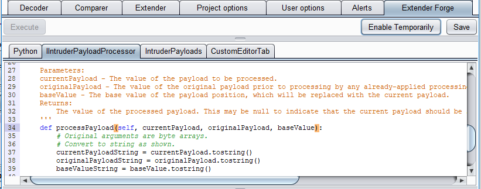

# BurpExtenderForge
An Extender for Burp Suite allowing you to quickly craft Extenders in Burp.

I felt like starting my first open source Burp Extender in a fairly meta mood. Looks like this:

A basic python development env within burp and some example extenders really.

# Install Instructions

Clone the repository or download the zip file. If you are interested in the source code it is within "/src". However, if you just want the compiled Extender you will only need the contents of the /dist/ folder.

First you need to setup the dependencies. The /dist/lib folder includes the two dependencies:

 * jsyntaxpane-1.0.0.jar - for pretty Python editor with line numbers.
 * jython-standalone-2.7.0.jar - for enabling Python within Java
 
On the "Extender" -> "Options"  tabs configure:

 * Java Environment - This should point to a folder which contains all ".jar" files used by your Burp Extenders. If you have a folder configured already simply copy "jsyntaxpane-1.0.0.jar" into that folder. Otherwise you can select the "libs" folder.
 * Python Environment - Point this to the "jython-standalone-2.7.0.jar" file.
 
With the pre-requisites installed all you have to do is Load the extension Jar which is "/dist/BurpExtenderForge.jar". To do this goto the "Extender" tab and then click "Add". Select a Java extension type and then browse to the file.
 
# Usage

When the Extender loads you will get a new tab called "Extender Forge". If you want to try some python code to check things select the "Python" tab. This will enable the "Execute" button on the top left. This can be used to test simply Python code blocks safely.

Currently there are three Pythonic template files provided in the other tabs:

 * IIntruderPayloadProcessor - if you need a custom encoding routine for Intruder Payloads
 * IntruderPayloads - if you need to generate custom payloads for Intruder
 * CustomEditorTab - if you need a custom editor tab for trapped HTTP requests.
 
Why these? You can engineer the tasks I have needed to complete so far with Python Extenders!

Modify the code in these tabs and then click "Enable Temporarily" to try that Extender. This is a very hacky way of enabling an Extender so I don't recommend it full time. Once you have tried and tested your Extender use the "Save" option to permanently keep that file

# Future Development

Refactor to allow a "File" -> "New" -> "Select Template" workflow. So the tabs are only ones you have decided to author.

Add in more template files to cover more possible Extender types.

# Other Information

Blog Post about this over here:

http://blog.secarma.co.uk/labs/burp-extender-forge
